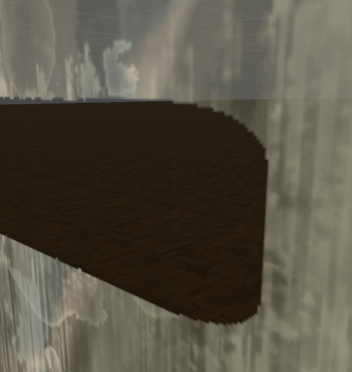

# SGHitBufferWriterシェーダのパラメータ解説

SGHitBufferWriterシェーダは平行投影カメラから取得できた深度情報を曇りガラスの曇り度合いの情報に変換するための、
CustomRenderTexture専用シェーダです。
お好みに合わせて [SmokeGlassシェーダ](SmokeGlass.md) と併せて設定していくことになります。

## Render Texture

ここには平行投影カメラで取得された深度バッファが格納されるRender Textureを指定します。
ここに指定するものは固定となりますので、基本的に一度設定したら変更はしないでください。

## Tolerance

これは深度情報のどれぐらいの距離を当たり判定として扱うかを決めるものです。
デフォルトは `0.99` のため、これもできるだけ変更しないようにしましょう。

## Using blur

曇っている部分のエッジをぼかすかどうかです。
ぼかすことによりリアルな曇り具合を演出できますが、指で文字書いたりする場合はこれをオフにすると良いでしょう。
有効/無効ボタンを用意するのもいいと思います。

* Blurをonにした場合の表示

* Blurをoffにした場合の表示

## Reset

このチェックボックスをonにするとデフォルトの状態にもどせます。
次で説明する `Enable Restoration` をオフにしている場合に使います。
ワールド内にボタンを設置し、これを有効して即座に無効にすることで曇っていない状態にもどせるため、
そのような使い方を想定しています。

## Enable Restoration

これを有効にすることによって曇りを拭った状態から徐々に曇った状態へ戻る機構を有効にできます。
逆に無効にすることによって拭った状態から戻らなくすることもできます。
無効にする場合は上記の `Reset` を合わせてリセットボタンなどを用意すると良いでしょう。

## Restoration Settings

`Enable Restoration` を有効にするとこの設定がトグルされます。

### Resolution

曇った状態から徐々に戻る段階の値です。デフォルトは `0.002` で、これが最小値となります。
この値は小さいほど綺麗に戻っていくので基本的にデフォルトが良いでしょう。

### Speed

曇った状態から戻る速度です。デフォルトは4で、数値を大きくすることにより遅く出来ます。
最大値は10となっていますので、これは後述する `Interpolation Type` と併せて調整してください。

### Interpolation Type

徐々に戻る場合、どのような戻り方をするかです。デフォルトは `Linear` です。

* Linear
** 線形補間です。常に一定の速度で戻っていきます。
* Hermite
** エルミート補間です。2つの点を基準に戻る速度に揺らぎを持たせることが出来ます。

### hermite Interpolation

`Interpolation Type` にて `Hermite` を指定した時にトグルされる項目です。

#### Left Point, Right Point

エルミート補間の2つのポイントを設定します。
https://thebookofshaders.com/glossary/?search=smoothstep