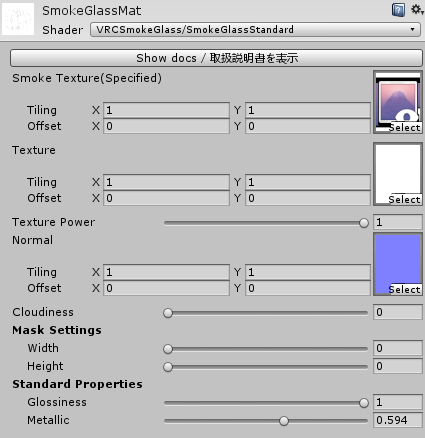

# SmokeGlassシェーダ

実際の曇りガラスの表現を行うシェーダです。4つのシェーダが用意されていますのでシーンによってお使い分け下さい。
パラメータの解説をしていますが、Unlit版にはいくつかのパラメータが存在しません。

|シェーダ名|説明|
|:--|:--|
|SmokeGlassStandard|Standardシェーダに基づく曇りガラスシェーダ|
|SmokeGlassStandardCullOff|Standardシェーダに基づく曇りガラスシェーダ（両面描画版）|
|SmokeGlassUnlit|Unlitシェーダに基づく曇りガラスシェーダ|
|SmokeGlassUnlitCullOff|Unlitシェーダに基づく曇りガラスシェーダ（両面描画版）|

## Smoke Texture (Specified)

ここには曇り状態を表すCustomRenderTextureを指定します。
即ちSGHitBufferWriterシェーダを割り当てたCustomRenderTextureです。
ここはこれ以外指定しようがありませんので固定となります。

## Texture

もし、窓の汚れや霜など模様をガラスにつけたい場合はこのテクスチャを指定します。
Booth購入された方には特典として数種類つけております。
これがあることでより臨場感が増しますが、後述する `Cloudiness` パラメータにより曇り状態は再現できます。

## Texture Power

`Texture` をどの割合で適用するかです。個人のフィーリングでお決めください。

## Normal

もし、窓の汚れや霜など模様をガラスにつけたい場合はここにノーマルテクスチャを指定します。
Booth購入された方には特典として数種類つけております。
これがあることでより臨場感が増しますが、後述する `Cloudiness` パラメータにより曇り状態は再現できます。

## Cloudiness

純粋な曇り状態の値です。
1にすることで完全に曇った状態にできますが、極端なためここも個人のフィーリングでお決めください。

## MaskSettings

マスクの設定です。RenderTextureの特性上、このガラスは正方形しか作れません。
そこで、ある程度の正方形の大きさで作り、ここのマスクで縦横比を変えることによってガラスの大きさを変更します。
ここでマスクが指定された場所は法線情報も乗らないため完全に透明となります。

### Width

ガラスの横の比率です。

### Height

ガラスの縦の比率です。

## Standard Properties

Standardシェーダにあるパラメータを持ってきました。
`Glossiness` と `Metallic` を設定することにより光沢表現を再現できます。
いい感じに設定してください。
