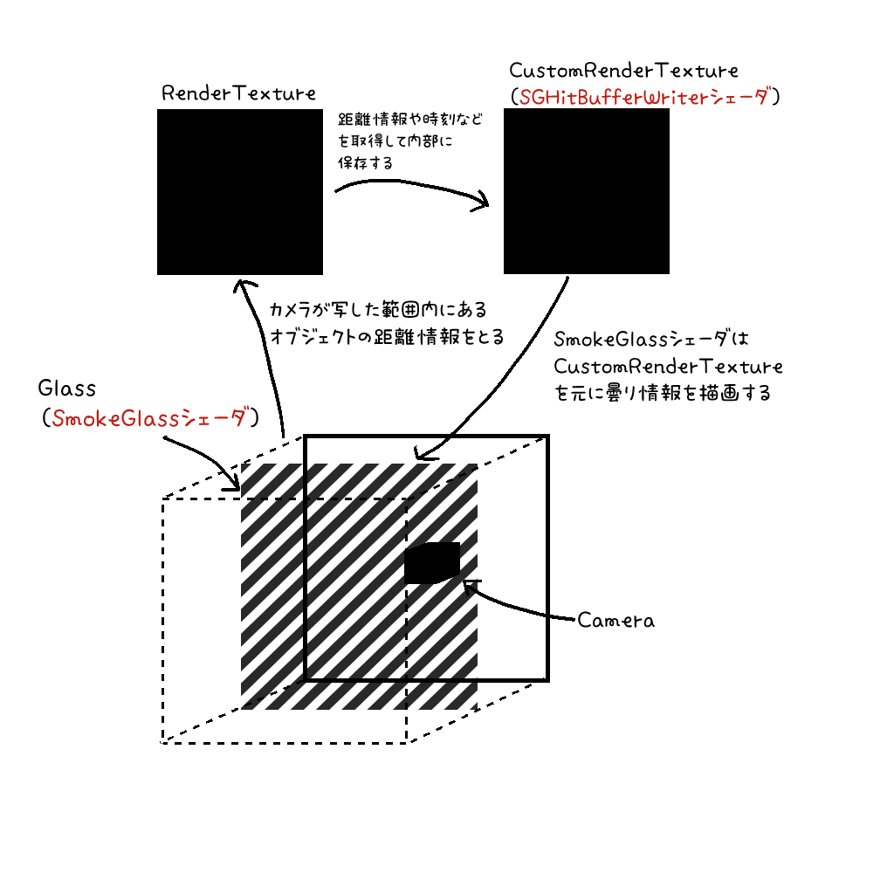

# このシェーダの構成

このシェーダは曇った状態のガラスを再現すべく制作された機構です。
厳密には現実のガラスのように光の屈折を行う処理は含めていませんので、あくまでも平面のみの環境で動作することを想定しています。

このシェーダは

* 1個の平行投影カメラ
* 1枚のRender Texture
* 1枚のCustom Render Texture
* Plane (またはQuad)

から構成され、スクリプトを使用せず、テクスチャをメモリ代わりに使い滑らかな曇りガラス処理を実現しています。

図にすると以下のような構成です。

ユーザが弄るパラメータは赤文字で記載されている `SGHitBufferWriter` シェーダと各 `SmokeGlass` シェーダとなります※。

用意されているprefabを使って導入する場合、それぞれを設定してあるマテリアルは、

|prefab名|マテリアルパス|
|:--|:--|
|SGHitBufferWriter|`Assets/SGSmokeGlass/Material/SGHitBufferWriterMat.mat`|
|SGStandard|`Assets/SGSmokeGlass/Material/DefaultSmokeGlass.mat`|
|SGCrystal|`Assets/SGSmokeGlass/Material/SGCrystal.mat`|
|SGDirt|`Assets/SGSmokeGlass/Material/SGDirt.mat`|
|SGRain|`Assets/SGSmokeGlass/Material/SGRain.mat`|
|SGFrost|`Assets/SGSmokeGlass/Material/SGFrost.mat`|
|SGNoise|`Assets/SGSmokeGlass/Material/SGNoise.mat`|
|SGNoise2|`Assets/SGSmokeGlass/Material/SGNoise2.mat`|
|SGUnlit|`Assets/SGSmokeGlass/Material/SGUnlit.mat`|
|SGUnlitTexture|`Assets/SGSmokeGlass/Material/SGUnlitTexture.mat`|

となります。 
たとえば、`SGStandard.prefab` を使う場合は、
* `Assets/SGSmokeGlass/Material/SGHitBufferWriterMat.mat`
* `Assets/SGSmokeGlass/Material/DefaultSmokeGlass.mat`
が操作すべきマテリアルとなります。

※： 
`SmokeGlass`は無料版でもついてくるものです。 
Boothで購入された方は `SGFrostStandard` など霜のついた曇りガラスのマテリアルなどもあります。