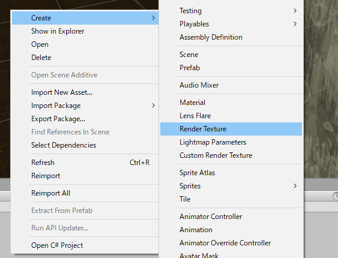
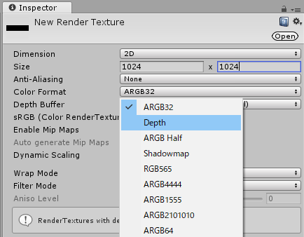

# 曇りガラスの作成方法

ここでは曇りガラスシェーダを使い1からセットアップする方法を紹介します。

1. [RenderTextureを作成する](#1RenderTextureを作成する)
2. [平行投影カメラを作成し、RenderTextureを割り当てる](#2平行投影カメラを作成しRenderTextureを割り当てる) 
3. [CustomRenderTexture用マテリアルを作成する](#3CustomRenderTexture用マテリアルを作成する)
4. [CustomRenderTextureを作成し、マテリアルを割り当てる](#4CustomRenderTextureを作成しマテリアルを割り当てる)
5. [表示用の板をカメラと同じサイズで用意、位置合わせをする](#5表示用の板をカメラと同じサイズで用意位置合わせをする)
6. [表示用のシェーダのマテリアルを作成し、割り当てる](#6表示用のシェーダのマテリアルを作成し割り当てる)

また、無料配布のunitypackageにはprefabが一つ含まれています。
それをHierarchyにドロップすることで初めから使える状態になります。

細かいガラスの調整に関しては以下の逆引きリファレンスを読んでください。

* [平行投影カメラとTolerance、表示面の調整](tips.md#平行投影カメラとTolerance、表示面の調整)
* [ガラスのマスクによる縦横比の調整](tips.md#ガラスのマスクによる縦横比の調整)
* [拭った状態から戻るスピードの調整](tips.md#拭った状態から戻るスピードの調整)
* [ガラスの模様と光沢表現](tips.md#ガラスの模様と光沢表現)

---

## 1.RenderTextureを作成する

`Project`で右クリックし、メニューを開き、`Create` -> `Render Texture` の順番で選択して `Render Texure` を作成してください。

そして、作成された `Render Texture` を選択し、Inspectorから `Color Format` を `Depth` に変更します。 
このとき、`Size` の項目もデフォルトの `256x256` では小さすぎるため、`1024x1024` や `2048x2048` あたりに設定すると良いでしょう。
（もちろんサイズを増やすと負荷が増えます。一応推奨値は `1024x1024` です）

## 2.平行投影カメラを作成し、RenderTextureを割り当てる

## 3.CustomRenderTexture用マテリアルを作成する

## 4.CustomRenderTextureを作成し、マテリアルを割り当てる

## 5.表示用の板をカメラと同じサイズで用意、位置合わせをする

## 6.表示用のシェーダのマテリアルを作成し、割り当てる
