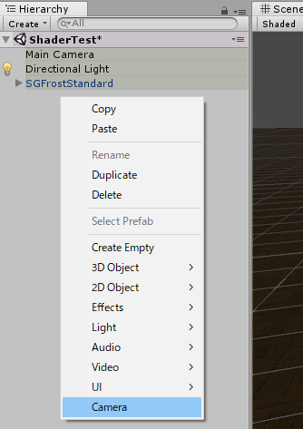
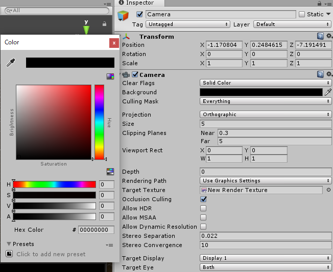
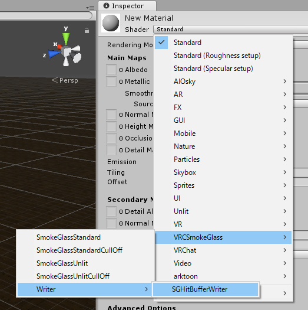
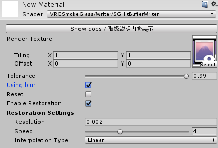
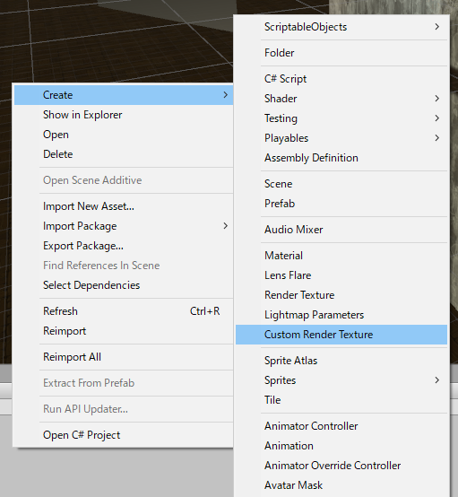

# 曇りガラスを一から導入する

ここでは曇りガラスシェーダを使い1からセットアップする方法を紹介します。

1枚だけワールドに配置する場合はセットアップ済みの`prefab`を`Hierarchy`にドロップすることで簡単につかえますが、
2枚目以降を作成する場合は`Render Texture`など自分で新たに作成する必要があります（もちろん2枚つかうことは重くなりますので非推奨ではあります）
この解説はその方向けのため、最初に配置する方は [曇りガラスをprefabから導入する](setup_with_prefab.md) を参照してください。

1. [RenderTextureを作成する](#1RenderTextureを作成する)
2. [平行投影カメラを作成し、RenderTextureを割り当てる](#2平行投影カメラを作成しRenderTextureを割り当てる) 
3. [CustomRenderTexture用マテリアルを作成する](#3CustomRenderTexture用マテリアルを作成する)
4. [CustomRenderTextureを作成し、マテリアルを割り当てる](#4CustomRenderTextureを作成しマテリアルを割り当てる)
5. [表示用の板をカメラと同じサイズで用意、位置合わせをする](#5表示用の板をカメラと同じサイズで用意位置合わせをする)
6. [表示用のシェーダのマテリアルを作成し、割り当てる](#6表示用のシェーダのマテリアルを作成し割り当てる)

また、無料配布のunitypackageにはprefabが一つ含まれています。
それをHierarchyにドロップすることで初めから使える状態になります。

細かいガラスの調整に関しては以下の逆引きリファレンスを読んでください。

* [平行投影カメラとTolerance、表示面の調整](tips.md#平行投影カメラとTolerance、表示面の調整)
* [ガラスのマスクによる縦横比の調整](tips.md#ガラスのマスクによる縦横比の調整)
* [拭った状態から戻るスピードの調整](tips.md#拭った状態から戻るスピードの調整)
* [ガラスの模様と光沢表現](tips.md#ガラスの模様と光沢表現)

---

## 1.RenderTextureを作成する

まず深度情報（ガラスからどれだけ近いのか）を取得するために `Render Texture` を作成します。

`Projectエリア`で右クリックし、メニューを開き、`Create` -> `Render Texture` の順番で選択して `Render Texure` を作成してください。

そして、作成された `Render Texture` を選択し、Inspectorから `Color Format` を `Depth` に変更します。 
このとき、`Size` の項目もデフォルトの `256x256` では小さすぎるため、`1024x1024` や `2048x2048` あたりに設定すると良いでしょう。
（もちろんサイズを増やすと負荷が増えます。一応推奨値は `1024x1024` です）

## 2.平行投影カメラを作成し、RenderTextureを割り当てる

次に深度情報を写すためのカメラを作成します。

`Hierarchy` の空いているスペースで右クリックし、`Camera` を選択してカメラを作成します。

次に作成されたカメラを選択し、`Hierarchy` に表示された設定を行っていくのですが、ここは項目が多いです。

* `Clear Flags` を `Solid Color` にして `Background` を真っ黒の状態にします
  * 深度は赤で書き込まれるので赤の情報が入っていなければなんでもいいです
* `Projection` を `Orthographic` にします
  * これにより平行投影カメラになります。`Size`についてはガラスの大きさに直結するため、[平行投影カメラとTolerance、表示面の調整](tips.md#平行投影カメラとTolerance、表示面の調整)で解説しています。
* `Clipping Planes` の `Far` を `5` に設定します。
  * `5` はこちらで設定しているデフォルトの値です。
  * シーン上でカメラの箱状のサイズが変わるかと思います。この範囲内に入ったオブジェクトの深度情報を取ることができます。
* `Target Texture` に先ほど作成した `Render Texture` をドロップして設定します。
* `Allow HDR` のチェックボックスを外します。
* `Allow MSAA` のチェックボックスを外します。

この画像のようになっていれば大丈夫なはずです。

## 3.CustomRenderTexture用マテリアルを作成する

お次は作成した平行投影カメラから得た深度情報をガラスの曇り情報へと変換するための `CustomRenderTexture` を作成するのですが、
この `Custom Render Texture` には曇り情報へと変換するためのシェーダを割り当てたマテリアルを作成する必要があります。

`Projectエリア` の空いている部分を右クリックし、 `Create` -> `Material` を選択し、 `Material` を作成します。

次に作成した `Material` を選択し、 `Inspector` から設定を行います。
まずはシェーダを選択します。`VRCSmokeGlass` -> `Writer` -> `SGHitBufferWriter` の順で選択してください。 
これは `Smoke Glass Hit Buffer Writer` の略で、`曇りガラス当たり判定バッファ書き込み機` の意です。

次にこのシェーダの設定を行っていきます。

* `Render Texture` に先ほど作成した `Render Txture` を指定します。
* `Tolerance` は基本的に弄りません。そのままで。
* `Using blur` は曇っている表現をリアルにしたい場合はonにしてください。ガラスにお絵かきしたい場合はoffがお勧めです。
* `Reset` は曇り状態リセット用です。 `Enable Restoration` をオフにしているときはこれを即座にon/offするボタンを作ってあげると喜ばれます。
* `Enable Restoration` は基本的にonにしておきましょう。これを有効にすることで拭った場所が徐々に曇った状態へ戻ります。

 

補間方法など詳しいパラメータの説明は [SGHitBufferWriterシェーダのパラメータ解説](SGBufferWriter.md) を参照してください。

## 4.CustomRenderTextureを作成し、マテリアルを割り当てる

`Render Texture` の時と同じように、 `Projectエリア` の空いている部分を右クリックし、 `Create` -> `Custom Render Texture` の順に選択し、`Custom Render Texture` を作成します。

## 5.表示用の板をカメラと同じサイズで用意、位置合わせをする

## 6.表示用のシェーダのマテリアルを作成し、割り当てる
