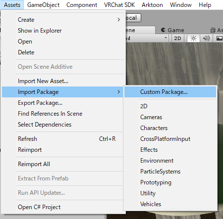
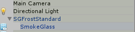

# 曇りガラスをprefabから導入する

githubには1つのサンプルprefabが、Booth購入者には予めテクスチャまでセットアップされたprefabが複数ついてきます。
ここではそれらprefabを用いた曇りガラスのワールドへの設置を解説していきます。

prefabでワールドに導入できる曇りガラスが原則として1枚のみですが、
複数設置したい場合は [曇りガラスをprefabから導入する](setup_with_prefab.md) を参照し、自分で一からセットアップする必要があります。
（問題となるのは `RenderTexture` と `CustomRenderTexture` なのでそこだけ入れ替えても大丈夫ですが）

1. [unitypackageをロードする](#1unitypackageをロードする)
2. [prefabから曇りガラスをワールドに設置する](#2prefabから曇りガラスをワールドに設置する)

細かいガラスの調整に関しては以下の逆引きリファレンスを読んでください。

* [平行投影カメラとTolerance、表示面の調整](tips.md#平行投影カメラとTolerance、表示面の調整)
* [ガラスのマスクによる縦横比の調整](tips.md#ガラスのマスクによる縦横比の調整)
* [拭った状態から戻るスピードの調整](tips.md#拭った状態から戻るスピードの調整)
* [ガラスの模様と光沢表現](tips.md#ガラスの模様と光沢表現)

---

## 1.unitypackageをロードする

GithubのRelelasesからダウンロード、またはBoothで購入した場合はzipの中にunitypackageが入っています。

それをUnityに直接ドロップ操作を行うか、以下の画像のように `Assets` -> `Import Package` -> `Custom Package` からインポートを行ってください。

## 2.prefabから曇りガラスをワールドに設置する

prefabは `VRCSmokeGlass` フォルダ直下に設置しています（無料版は `SGStandard.prefab`, `SGUnlit.prefab` のみ）。

|prefab名|説明|
|:--|:--|
|SGStandard.prefab|テクスチャが設定されていない標準の曇りガラス|
|SGUnlit.prefab|Unlit版曇りガラス|
|SGCrystal.prefab|クリスタルのような霜のついた曇りガラス（BOOTH購入者限定）|
|SGDirt.prefab|少し汚れた曇りガラス（BOOTH購入者限定）|
|SGRain.prefab|水滴のついた曇りガラス（BOOTH購入者限定）|
|SGFrost.prefab|霜に覆われた曇りガラス（BOOTH購入者限定）|
|SGNoise.prefab|ざらざらした質感の曇りガラス（BOOTH購入者限定）|
|SGNoise2.prefab|ざらざらした質感の曇りガラス（BOOTH購入者限定）|
|SGUnlitTexture.prefab|Unlit版曇りガラスに霜テクスチャを足したもの（BOOTH購入者限定）|

これを `Hierarchy` にドロップすることでワールド上に曇りガラスを配置することが出来ます。
`SGFrostGlass.prefab` というprefabをロードするとHierarchyに以下の画像のように表示されます。

移動や回転をする場合は中にある `SmokeGlass` を動かさず、 `SGFrostStandard` という方を動かしてください。
ガラスの拡大や縦横比率は普通のオブジェクトのように操作できません。[ガラスのマスクによる縦横比の調整](tips.md#ガラスのマスクによる縦横比の調整) を読んでください。