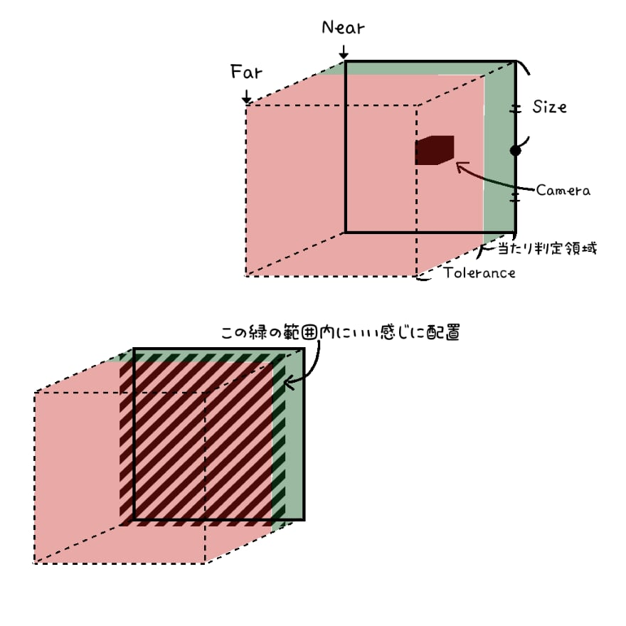
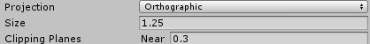
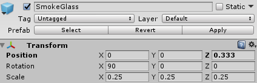
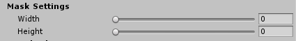

# 逆引きリファレンス

* [平行投影カメラとTolerance、表示面の調整](#平行投影カメラとTolerance、表示面の調整)
* [ガラスのマスクによる縦横比の調整](#ガラスのマスクによる縦横比の調整)
* [拭った状態から戻るスピードの調整](#拭った状態から戻るスピードの調整)
* [ガラスの模様と光沢表現](#ガラスの模様と光沢表現)

---

## 平行投影カメラとTolerance、表示面の調整

この曇りガラスの機構はカメラから得られたオブジェクトまでの距離情報を元に疑似的に "当たっている" という状態を作り出しているに過ぎません。
シェーダの機構では厳密に異なるオブジェクト同士が衝突している、という状態は検知することが出来ないのです。

ここで以下の画像を見てください。

これは `Custom Render Texture` に設定するマテリアルのシェーダ `SGHitBufferWriter` のパラメータとカメラ、実際に表示するガラスのplaneの関係を表したものです。

カメラから一番近い位置がカメラで設定している `Near`。

カメラから一番遠い位置がカメラで設定している `Far`です。

`SGHitBufferWriter` にある `Tolerance` パラメータはこの距離からマスクを行う比率であり、赤い部分がそれです。
この範囲にいるオブジェクトは *当たっている* という条件から除外されます。
そこから除外されなかったカメラから近い位置、すなわち緑の部分が *実際に当たっている部分* となります。

なので、実際にガラスとして描画されるQuadをどこに置くか、というと緑の場所に置くわけです。
これでも厳密に当たっている位置というのは誤差が生まれるので、実際に触れる前にガラスが反応してしまう、ということが頻繁に起こります。
そのような場合はこのPlaneの位置を前後に調整してみてください。

## ガラスのマスクによる縦横比の調整

### まずはガラスの大きさ

ガラスの大きさはカメラの大きさに依存します（カメラの範囲より大きくするとぼやけますし、大きくても小さくても実際に触れた場所と拭ったように表示される場所が異なってしまいます）。
そのため、まず大きさ自体を変えたい場合はカメラと、Planeの大きさを変更します。

Unityにおいて、Planeはスケールを変更していない大きさは `10` です。
対してカメラは一辺の長さを2等分した長さです。

カメラの大きさを上記のように、 `1.25` と設定した場合は、一辺の長さは `2.5` であるため、
Planeは以下の様に同じく `2.5` になるように、 `10` の1/4サイズである `0.25` を入力します。

この基準に気を付けて設定してみてください。

### 縦横比率

ガラスの大きさが変更できることがわかりましたが、肝心の縦横比率の設定をまだ解説していません。

実は `Render Texture` の特性上、*ガラスは正方形しか作れません*。

ただし、このシェーダではマスクの設定によって描画しないことによって疑似的にサイズ変更に対応するということを行っています。

各表示側シェーダにあるこの `Mask Settings` という項目です。

それぞれ `Width` は横方向、 `Height` は縦方向にマスクでき、どちらも `1` にすると完全に表示されない状態に出来ます※

縦横比率を変える場合は、オブジェクトそのもののスケールを変えるのではなく、これで調節しワールドにフィットさせてください。

※：とはいえこれで描画負荷は変わることはないので、完全に非表示にする場合はカメラごと非表示状態にしてください。

## 拭った状態から戻るスピードの調整

拭った状態から戻るスピードは、`SGHitBufferWriter` 側の `Speed` で調節します
（Resolutionによってどれぐらいの解像度で戻っていくのか指定できますが、ここを弄ることはオススメしません）。
最大は10ですが、10まで設定すると戻るまでかなりの時間がかかるでしょう。

`Interpolation Type` は戻る際にどれぐらいの緩急をもたせるかを設定できます。
デフォルトは `Linear` 、即ち線形補間を表しており、常に一定の割合で戻っていきます。

オプションとして `Hermite` を指定できるようになっていますが、
これはエルミート補間というよばれるもので、ただ単にシェーダにデフォルトで用意されているものを組み込んだだけです。
詳しくは `smoothstep` で調べると実際に視覚的にわかりやすいサイトがみつかるので調べてみてください。

## ガラスの模様と光沢表現

各曇りガラスシェーダはStandardシェーダが元となっているため、
`Glossiness` および `Metallic` の設定が出来るようにしています。

光沢表現が加わることでより一層それっぽくなるので色々弄ってみて下さい。